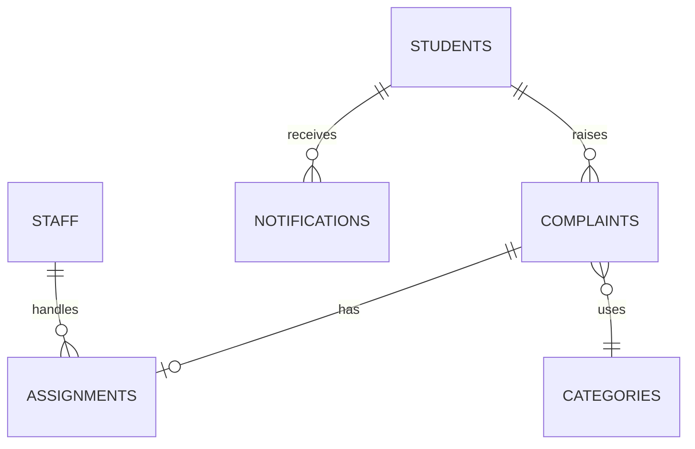

# HOSTEL FIX AI  Hostel Complaint Management System

A role-based hostel service portal built with React/Vite, Bootstrap 5, Flask REST API, JWT, SQLAlchemy, bcrypt, and MySQL.

## Project Structure

```text
backend/
  app/__init__.py       Application factory and upload serving
  app/models.py         SQLAlchemy MVC models
  app/routes/           Auth, complaints, admin, staff, notifications
  config.py             Environment configuration
  schema.sql            MySQL DDL and category seed data
  seed.py               Local admin/staff seed accounts
frontend/
  src/App.jsx           Routes and page-level workflows
  src/components/       Shared layout and status components
  src/api.js            Axios client with JWT interceptor
  src/styles.css        Responsive visual system
```

## One-Click Start (Windows)

The fastest way to run the whole project is to double-click **`start_all.bat`** at the project root. It will:

1. Create/activate the Python virtual environment and install backend dependencies
2. Seed the database with all role accounts
3. Start the **Flask backend** on `http://localhost:5000`
4. Install frontend dependencies (if needed) and start the **Vite frontend** on `http://localhost:5173`
5. Automatically open the app in your browser

Alternatively, run the two servers separately:
- **`start_backend.bat`** → starts only the Flask API
- **`start_frontend.bat`** → starts only the Vite dev server

## Run In VS Code (Manual)

### Backend

```powershell
cd backend
python -m venv .venv
.\.venv\Scripts\Activate.ps1
pip install -r requirements.txt
copy .env.example .env
# Set DATABASE_URL in .env for MySQL, or leave the default SQLite fallback
python seed.py
python run.py
```

### Frontend

```powershell
cd frontend
npm install
npm run dev
```

Open `http://localhost:5173`. The API runs at `http://localhost:5000`.

Seed accounts: `admin@havendesk.local` / `Admin@12345`, and `staff@havendesk.local` / `Staff@12345`. Change these before deployment.

## API Documentation

| Method | Endpoint | Role | Purpose |
|---|---|---|---|
| POST | `/api/auth/register` | Public | Register a student |
| POST | `/api/auth/login` | Public | Student/admin/staff JWT login |
| POST | `/api/auth/forgot-password` | Public | Password reset request placeholder |
| GET | `/api/complaints?mine=true` | Student | List own complaints |
| POST | `/api/complaints` | Student | Create complaint with optional image |
| PATCH | `/api/complaints/:id` | Student | Edit pending complaint |
| DELETE | `/api/complaints/:id` | Student/Admin | Delete complaint |
| GET | `/api/admin/dashboard` | Admin | Dashboard totals and report placeholders |
| GET | `/api/admin/students` | Admin | Student management list |
| GET | `/api/admin/staff` | Admin | Staff management list |
| POST | `/api/admin/staff` | Admin | Add staff |
| PATCH | `/api/admin/complaints/:id/status` | Admin/Staff | Update status and remarks |
| POST | `/api/admin/complaints/:id/assign` | Admin | Assign staff |
| GET | `/api/staff/complaints` | Staff | List assigned complaints |
| GET | `/api/notifications` | Student | List notifications |

All protected routes expect `Authorization: Bearer <accessToken>`.

## Database Schema / ER Diagram



`backend/schema.sql` contains the complete MySQL schema with primary keys, foreign keys, indexes through unique email fields, and cascade behavior. SQLAlchemy can also create the tables automatically for local SQLite development.

## Production Notes

- Set a long random `JWT_SECRET_KEY` and a MySQL `DATABASE_URL` in `.env`.
- Put the API behind HTTPS and restrict `Flask-CORS` origins to the deployed frontend.
- Add a durable object store for complaint images instead of local disk in a multi-instance deployment.
- The UI includes the core student workflow and dashboard shell; admin/staff management endpoints are ready for extending the remaining table actions and export adapters..
